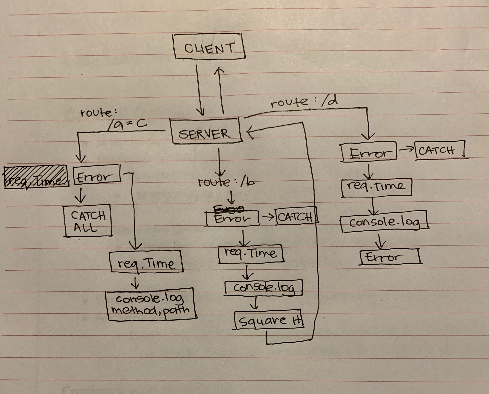

 LAB
=================================================

## Express Middleware

### Author: Melissa Stock & Rebecca Peterson

### Links and Resources
* [submission PR](https://github.com/401-advancedjs/lab-07-middleware/compare/middleware-mel?expand=1)
* [travis](https://www.travis-ci.com/401-advancedjs/lab-07-middleware)

#### Documentation
* [express docs](https://expressjs.com/)

### Modules
#### `errorHandler.js`
#### `router.js`
#### `logger.js`
#### `nextError.js`
#### `reqTime.js`
#### `notFound.js`
#### `squareIt(num).js`

##### Exported Values and Methods

###### `errorHandler(error) -> error`
###### `router() -> string`
###### `logger() -> string`
###### `nextError() -> error`
###### `reqTime() -> string`
###### `notFound() -> error`
###### `squareIt(num) -> number`

### Setup
#### `.env` requirements
* `PORT` - Port Number

#### Running the app
* `http localhost:8080`
* Endpoint: `/a`
  * Returns status(200)
* Endpoint: `/b/:num`
  * Returns a JSON object with num squared
* Endpoint: `/c`
  * Returns status(200)
* Endpoint: `/d`
  * Returns status(400) -> error
  
#### Tests
* How do you run tests? `npm test`
* What assertions were made? 
  * No assertions are made yet
* What assertions need to be / should be made?
  * That middleware is being accessed properly
  * That route /b takes in an integer as a paramter
  * That route /b returns an object containing that interger sqaured
  * That route /d errors out

#### UML

